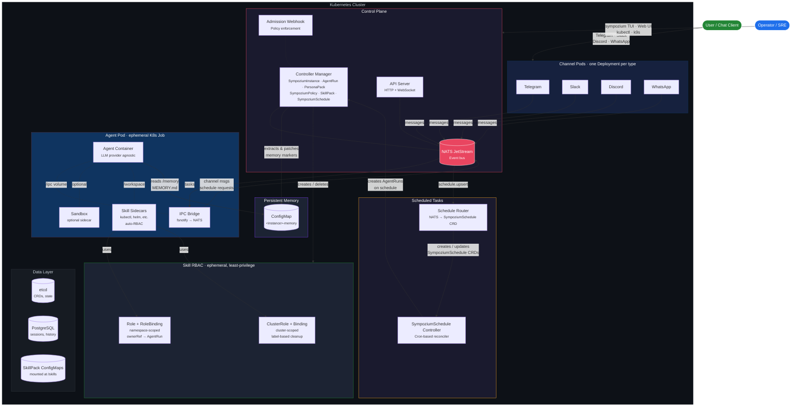

<p align="center">
  <a href="https://www.youtube.com/watch?v=ZUT60Bopa4s">
    
  </a>
</p>

<p align="center">
  
</p>

<p align="center">
 
  <em>
  Every agent is an ephemeral Pod.<br>Every policy is a CRD. Every execution is a Job.<br>
  Orchestrate multi-agent workflows <b>and</b> let agents diagnose, scale, and remediate your infrastructure.<br>
  Multi-tenant. Horizontally scalable. Safe by design.</em><br><br>
  From the creator of <a href="https://github.com/k8sgpt-ai/k8sgpt">k8sgpt</a> and <a href="https://github.com/AlexsJones/llmfit">llmfit</a>
</p>

<p align="center">
  <b>
  This project is under active development. API's will change, things will be break. Be brave.
  <b />
</p>
<p align="center">
  <a href="https://github.com/AlexsJones/sympozium/actions"></a>
  <a href="https://github.com/AlexsJones/sympozium/releases/latest"></a>
  <a href="LICENSE"></a>
</p>

<p align="center">
  
</p>

---
### Quick Install (macOS / Linux)

**Homebrew:**
```bash
brew tap AlexsJones/sympozium
brew install sympozium
```

**Shell installer:**
```bash
curl -fsSL https://deploy.sympozium.ai/install.sh | sh
```

Then deploy to your cluster and activate your first agents:

```bash
sympozium install          # deploys CRDs, controllers, and built-in PersonaPacks
sympozium                  # launch the TUI — go to Personas tab, press Enter to onboard
# (WIP): sympozium serve            # open the web dashboard (port-forwards to the in-cluster UI)
```

`sympozium install` now also deploys a built-in OpenTelemetry collector (`sympozium-otel-collector`) so telemetry and dashboard observability features are available by default.

Sympozium ships with **PersonaPacks** — pre-configured bundles of agents that you activate with a few keypresses. No YAML required. See [PersonaPacks](#personapacks) below.

Choose your interface: a **k9s-style terminal UI** (`sympozium`) or a **full web dashboard** (`sympozium serve`). Both support all operations.

📖 **New here?** See the [Getting Started guide](docs/getting-started.md) — install, deploy, onboard your first agent, and learn the TUI, web UI, and CLI commands.

### Advanced: Helm Chart

For production and GitOps workflows, you can deploy the control plane separately using Helm and install the CLI independently.

#### Control Plane

**Prerequisites:** [cert-manager](https://cert-manager.io/) (for webhook TLS):
```bash
kubectl apply -f https://github.com/cert-manager/cert-manager/releases/download/v1.17.1/cert-manager.yaml
```

Deploy the Sympozium control plane:
```bash
helm install sympozium ./charts/sympozium
```

See [`charts/sympozium/values.yaml`](charts/sympozium/values.yaml) for configuration options (replicas, resources, external NATS, network policies, etc.).

By default, the Helm chart also deploys a built-in OpenTelemetry collector:

```yaml
observability:
  enabled: true
  collector:
    service:
      otlpGrpcPort: 4317
      otlpHttpPort: 4318
      metricsPort: 8889
```

Disable it if you already run a shared collector:

```yaml
observability:
  enabled: false
```

#### CLI

Install the CLI on your local machine to connect to the cluster:

```bash
brew tap AlexsJones/sympozium && brew install sympozium
# or
curl -fsSL https://deploy.sympozium.ai/install.sh | sh
```

## Why Sympozium?

Sympozium serves **two powerful use cases** on one Kubernetes-native platform:

1. **Orchestrate fleets of AI agents** — customer support, code review, data pipelines, or any domain-specific workflow. Each agent gets its own pod, RBAC, and network policy with proper tenant isolation.
2. **Administer the cluster itself agentically** — point agents inward to diagnose failures, scale deployments, triage alerts, and remediate issues, all with Kubernetes-native isolation, RBAC, and audit trails.

Agentic frameworks like OpenClaw pioneered rich agent orchestration — sub-agent registries, tool pipelines, channel integrations, and sandbox execution. But they run as **in-process monoliths** with file-based state, single-instance locks, and tightly coupled plugin systems.

Sympozium takes the same agentic control model and rebuilds it on Kubernetes primitives:

### Isolated Skill Sidecars — a game-changer

Most agent frameworks dump every tool into one shared process. One bad `kubectl delete` and your whole agent environment is toast. Sympozium does this completely differently:

**Every skill runs in its own sidecar container** — a separate, isolated process injected into the agent pod at runtime. Use skills to give agents cluster-admin capabilities (`kubectl`, `helm`, scaling) or domain-specific tools — each with ephemeral least-privilege RBAC that's garbage-collected when the run finishes. Toggle a skill on, and the controller automatically:

- Injects a dedicated sidecar container with only the binaries that skill needs (`kubectl`, `helm`, `terraform`, etc.)
- Provisions **ephemeral, least-privilege RBAC** scoped to that single agent run — no standing permissions, no god-roles
- Shares a `/workspace` volume so the agent can coordinate with the sidecar
- **Garbage-collects everything** when the run finishes — containers, roles, bindings, all gone

This means you can give an agent full `kubectl` access for a troubleshooting run without worrying about leftover permissions. Skills are declared as CRDs, toggled per-instance in the TUI with a single keypress, and their containers are built and shipped alongside the rest of Sympozium. No plugins to install, no runtime to configure — just Kubernetes-native isolation that scales.

> _"Give the agent tools, not trust."_ — Whether it's orchestrating a fleet or administering the cluster, skills get exactly the permissions they declare, for exactly as long as the run lasts, and not a second longer.

### How it compares

| Concern | OpenClaw (in-process) | Sympozium (Kubernetes-native) |
|---------|----------------------|----------------------------|
| **Agent execution** | Shared memory, single process | Ephemeral **Pod** per invocation (K8s Job) |
| **Orchestration** | In-process registry + lane queue | **CRD-based** registry with controller reconciliation |
| **Sandbox isolation** | Long-lived Docker sidecar | Pod **SecurityContext** + PodSecurity admission |
| **IPC** | In-process EventEmitter | Filesystem sidecar + **NATS JetStream** |
| **Tool/feature gating** | 7-layer in-process pipeline | **Admission webhooks** + `SympoziumPolicy` CRD |
| **Persistent memory** | Files on disk (`~/.openclaw/`) | **ConfigMap** per instance, controller-managed |
| **Scheduled tasks** | Cron jobs / external scripts | **SympoziumSchedule CRD** with cron controller |
| **State** | SQLite + flat files | **etcd** (CRDs) + PostgreSQL + object storage |
| **Multi-tenancy** | Single-instance file lock | **Namespaced CRDs**, RBAC, NetworkPolicy |
| **Scaling** | Vertical only | **Horizontal** — stateless control plane, HPA |
| **Channel connections** | In-process per channel | Dedicated **Deployment** per channel type |
| **Observability** | Application logs | `kubectl logs`, events, conditions, **OpenTelemetry traces/metrics**, **k9s-style TUI**, **web dashboard** |

The result: every concept that OpenClaw manages in application code, Sympozium expresses as a Kubernetes resource — then adds the ability to point agents at the cluster itself. Declarative, reconcilable, observable, and scalable.

---

### Deploy to Your Cluster

```bash
sympozium install          # CRDs, controllers, webhook, NATS, RBAC, network policies
sympozium onboard          # interactive setup wizard — instance, provider, channel
sympozium                  # launch the interactive TUI (default command)
sympozium serve            # open the web dashboard in your browser
sympozium uninstall        # clean removal
```

### Slack setup (Socket Mode)

For reliable Slack connectivity, configure your Slack app with both tokens and required app settings:

- Provide both secrets in the channel secret:
  - `SLACK_BOT_TOKEN` (`xoxb-...`)
  - `SLACK_APP_TOKEN` (`xapp-...`)
- Enable **App Home → Messages Tab** and allow users to message the app.
- Enable **Socket Mode**.
- Add bot event subscriptions:
  - `message.im`
  - `message.channels`
  - `app_mention`
- Reinstall the app after changing scopes or event subscriptions.

If `SLACK_APP_TOKEN` is omitted, Sympozium falls back to Slack Events API mode, which requires a publicly reachable webhook URL.

## Architecture



### How It Works

1. **A message arrives** via a channel pod (Telegram, Slack, etc.) and is published to the NATS event bus.
2. **The controller creates an AgentRun CR**, which reconciles into an ephemeral K8s Job — an agent container + IPC bridge sidecar + optional sandbox + skill sidecars (with auto-provisioned RBAC).
3. **The agent container** calls the configured LLM provider (OpenAI, Anthropic, Azure, Ollama, or any OpenAI-compatible endpoint), with skills mounted as files, persistent memory injected from a ConfigMap, and tool sidecars providing runtime capabilities like `kubectl`.
4. **Results flow back** through the IPC bridge → NATS → channel pod → user. The controller extracts structured results and memory updates from pod logs.
5. **Everything is a Kubernetes resource** — instances, runs, policies, skills, and schedules are all CRDs. Lifecycle is managed by controllers. Access is gated by admission webhooks. Network isolation is enforced by NetworkPolicy. The TUI and web dashboard give you full visibility into the entire system.

---

### Built-in Agent Tools

Every agent pod has these tools available out of the box (no skill sidecar required for native tools):

| Tool | Type | Description |
|------|------|-------------|
| `execute_command` | IPC (sidecar) | Execute shell commands (`kubectl`, `bash`, `curl`, `jq`, etc.) in the skill sidecar container. Timeout-configurable, working directory support. |
| `read_file` | Native | Read file contents from the pod filesystem (`/workspace`, `/skills`, `/tmp`, `/ipc`). Truncated at 100 KB. |
| `write_file` | Native | Create or overwrite files under `/workspace` or `/tmp`. Auto-creates parent directories. |
| `list_directory` | Native | List directory contents with type, size, and name. |
| `fetch_url` | Native | Fetch web pages or API endpoints. HTML is converted to readable plain text; JSON returned as-is. Supports custom headers, configurable max chars (default 50k). |
| `send_channel_message` | IPC (bridge) | Send a message through a connected channel (WhatsApp, Telegram, Discord, Slack). Routes via IPC bridge → NATS → channel pod. |
| `schedule_task` | IPC (bridge) | Create, update, suspend, resume, or delete recurring `SympoziumSchedule` tasks. Routes via IPC bridge → NATS → schedule router. |

> **Native** tools run directly in the agent container. **IPC** tools communicate with sidecars or the IPC bridge via the shared `/ipc` volume. See the **[Tool Authoring Guide](docs/writing-tools.md)** for how to add your own.

### Built-in Skills (SkillPacks)

Skills are mounted as files into agent pods and optionally inject sidecar containers with runtime tools. Toggle skills per-instance in the TUI with `s` → `Space`.

| SkillPack | Category | Sidecar | Description | Status |
|-----------|----------|---------|-------------|--------|
| `k8s-ops` | Kubernetes | ✅ `kubectl`, `curl`, `jq` | Cluster inspection, workload management, troubleshooting, scaling. Full admin RBAC auto-provisioned per run. | **Stable** |
| `sre-observability` | SRE | ✅ `kubectl`, `curl`, `jq` | Prometheus/Loki/Kubernetes observability workflows: health triage, metrics queries, and deep log/event correlation. Read-only observability RBAC auto-provisioned per run. | **Alpha** |
| `llmfit` | SRE | ✅ `llmfit`, `kubectl`, `jq` | Node-level model placement analysis. Runs llmfit probes per node and ranks best nodes for requested models. | **Alpha** |
| `incident-response` | SRE | ✅ | Structured incident triage — gather context, diagnose root cause, suggest remediation. | **Alpha** |
| `code-review` | Development | — | Code review guidelines and best practices for pull request analysis. | **Alpha** |

### Channels

Channels connect Sympozium to external messaging platforms. Each channel runs as a dedicated Kubernetes Deployment. Messages flow through NATS JetStream and are routed to AgentRuns by the channel router.

| Channel | Protocol | Self-chat | Status |
|---------|----------|-----------|--------|
| **WhatsApp** | WhatsApp Web (multidevice) via `whatsmeow` | ✅ Owner can message themselves to interact with agents | **Stable** |
| **Telegram** | Bot API (`tgbotapi`) | ✅ Owner can message themselves to interact with agents | **Stable** |
| **Discord** | Gateway WebSocket (`discordgo`) | — | **Alpha** |
| **Slack** | Socket Mode (`slack-go`) | — | **Alpha** |

> **Stable** — tested and actively used. **Alpha** — implemented but not yet production-tested.

---

## Custom Resources

Sympozium models every agentic concept as a Kubernetes Custom Resource:

| CRD | Kubernetes Analogy | Purpose |
|-----|--------------------|---------|
| `SympoziumInstance` | Namespace / Tenant | Per-user gateway — channels, provider config, memory settings, skill bindings |
| `AgentRun` | Job | Single agent execution — task, model, result capture, memory extraction |
| `SympoziumPolicy` | NetworkPolicy | Feature and tool gating — what an agent can and cannot do |
| `SkillPack` | ConfigMap | Portable skill bundles — kubectl, Helm, or custom tools — mounted into agent pods as files, with optional sidecar containers for cluster ops |
| `SympoziumSchedule` | CronJob | Recurring tasks — heartbeats, sweeps, scheduled runs with cron expressions |
| `PersonaPack` | Helm Chart / Operator Bundle | Pre-configured agent bundles — activating a pack stamps out instances, schedules, and memory for each persona |

### PersonaPacks

PersonaPacks are the **recommended way to get started** with Sympozium. A PersonaPack is a CRD that bundles multiple pre-configured agent personas — each with a system prompt, skills, tool policy, schedule, and memory seeds. Activating a pack is a single action: the PersonaPack controller stamps out all the Kubernetes resources automatically.

**Why PersonaPacks?**

Without PersonaPacks, setting up even one agent requires creating a Secret, SympoziumInstance, SympoziumSchedule, and memory ConfigMap by hand. PersonaPacks collapse that into: pick a pack → enter your API key → done.

**How it works:**

```
PersonaPack "platform-team" (3 personas)
  │
  ├── Activate via TUI (Enter on pack → wizard → API key → confirm)
  │
  └── Controller stamps out:
      ├── Secret: platform-team-openai-key
      ├── SympoziumInstance: platform-team-security-guardian
      │   ├── SympoziumSchedule: ...security-guardian-schedule (every 30m)
      │   └── ConfigMap: ...security-guardian-memory (seeded)
      ├── SympoziumInstance: platform-team-sre-watchdog
      │   ├── SympoziumSchedule: ...sre-watchdog-schedule (every 5m)
      │   └── ConfigMap: ...sre-watchdog-memory (seeded)
      └── SympoziumInstance: platform-team-platform-engineer
          ├── SympoziumSchedule: ...platform-engineer-schedule (weekdays 9am)
          └── ConfigMap: ...platform-engineer-memory (seeded)
```

All generated resources have `ownerReferences` pointing back to the PersonaPack — delete the pack and everything gets garbage-collected.

**Built-in packs:**

| Pack | Category | Agents | Description |
|------|----------|--------|-------------|
| `platform-team` | Platform | Security Guardian, SRE Watchdog, Platform Engineer | Core platform engineering — security audits, cluster health, manifest review |
| `devops-essentials` | DevOps | Incident Responder, Cost Analyzer | DevOps workflows — incident triage, resource right-sizing |

**Activating a pack in the TUI:**

<p align="center">
  
</p>

1. Launch `sympozium` — the TUI opens on the **Personas** tab (view 1)
2. Select a pack and press **Enter** to start the onboarding wizard
3. Choose your AI provider and paste an API key
4. Optionally bind channels (Telegram, Slack, Discord, WhatsApp)
5. Confirm — the controller creates all instances within seconds

**Activating via kubectl:**

```yaml
# 1. Create the provider secret
kubectl create secret generic my-pack-openai-key \
  --from-literal=OPENAI_API_KEY=sk-...

# 2. Patch the PersonaPack with authRefs to trigger activation
kubectl patch personapack platform-team --type=merge -p '{
  "spec": {
    "authRefs": [{"provider": "openai", "secret": "my-pack-openai-key"}]
  }
}'
```

The controller detects the `authRefs` change and reconciles — creating SympoziumInstances, Schedules, and memory ConfigMaps for each persona.

**Writing your own PersonaPack:**

```yaml
apiVersion: sympozium.ai/v1alpha1
kind: PersonaPack
metadata:
  name: my-team
spec:
  description: "My custom agent team"
  category: custom
  version: "1.0.0"
  personas:
    - name: my-agent
      displayName: "My Agent"
      systemPrompt: |
        You are a helpful assistant that monitors the cluster.
      skills:
        - k8s-ops
      toolPolicy:
        allow: [read_file, list_directory, execute_command, fetch_url]
      schedule:
        type: heartbeat
        interval: "1h"
        task: "Check cluster health and report any issues."
      memory:
        enabled: true
        seeds:
          - "Track recurring issues for trend analysis"
```

Apply it with `kubectl apply -f my-team.yaml`, then activate through the TUI.

### Skill Sidecars

SkillPacks can declare a **sidecar container** that is dynamically injected into the agent pod when the skill is active. The controller automatically creates scoped RBAC:

```
SympoziumInstance has skills: [k8s-ops]
  → AgentRun created
    → Controller resolves SkillPack "k8s-ops"
      → Finds sidecar: { image: skill-k8s-ops, rbac: [...] }
      → Injects sidecar container into pod
      → Creates Role + RoleBinding (namespace-scoped)
      → Creates ClusterRole + ClusterRoleBinding (cluster-wide access)
    → Pod runs with kubectl + RBAC available
    → On completion/deletion: all skill RBAC cleaned up
```

The `k8s-ops`, `sre-observability`, and `llmfit` built-in skills provide sidecars for cluster operations and placement analysis. `k8s-ops` is designed for active workload management, `sre-observability` is read-only for metrics/logs/events triage, and `llmfit` probes each node to rank the best placement for a target model. See the **[Skill Authoring Guide](docs/writing-skills.md)** for a full walkthrough of building your own skills. To enable a skill, toggle it on your instance:

```
# In the TUI: press 's' on an instance → Space to toggle k8s-ops / llmfit
# Or via kubectl:
kubectl patch sympoziuminstance <name> --type=merge -p '{"spec":{"skills":[{"skillPackRef":"k8s-ops"},{"skillPackRef":"llmfit"}]}}'
```

### Security

Sympozium enforces defence-in-depth at every layer — from network isolation to per-run RBAC:

| Layer | Mechanism | Scope |
|-------|-----------|-------|
| **Network** | `NetworkPolicy` deny-all egress on agent pods | Only the IPC bridge can reach NATS; agents cannot reach the internet or other pods |
| **Pod sandbox** | `SecurityContext` — `runAsNonRoot`, UID 1000, read-only root filesystem | Every agent and sidecar container runs with least privilege |
| **Admission control** | `SympoziumPolicy` admission webhook | Feature and tool gates enforced before the pod is created |
| **Skill RBAC** | Ephemeral `Role`/`ClusterRole` per AgentRun | Each skill declares exactly the API permissions it needs — the controller auto-provisions them at run start and revokes them on completion |
| **RBAC lifecycle** | `ownerReference` (namespace) + label-based cleanup (cluster) | Namespace RBAC is garbage-collected by Kubernetes. Cluster RBAC is cleaned up by the controller on AgentRun completion and deletion. |
| **Controller privilege** | `cluster-admin` binding | The controller needs `cluster-admin` to create arbitrary RBAC rules declared by SkillPacks (Kubernetes prevents RBAC escalation otherwise) |
| **Multi-tenancy** | Namespaced CRDs + Kubernetes RBAC | Instances, runs, and policies are namespace-scoped; standard K8s RBAC controls who can create them |

The skill sidecar RBAC model deserves special attention: permissions are **created on-demand** when an AgentRun starts, scoped to exactly the APIs the skill needs, and **deleted when the run finishes**. There is no standing god-role — each run gets its own short-lived credentials. This is the Kubernetes-native equivalent of temporary IAM session credentials.

### Persistent Memory

Each `SympoziumInstance` can enable **persistent memory** — a ConfigMap (`<instance>-memory`) containing `MEMORY.md` that is:
- Mounted read-only into every agent pod at `/memory/MEMORY.md`
- Prepended as context so the agent knows what it has learned
- Updated after each run — the controller extracts memory markers from pod logs and patches the ConfigMap

This gives agents **continuity across runs** without external databases or file systems. Memory lives in etcd alongside all other cluster state.

### Scheduled Tasks (Heartbeats)

`SympoziumSchedule` resources define cron-based recurring agent runs — perfect for automated cluster health checks, overnight alert reviews, resource right-sizing sweeps, or any domain-specific task:

```yaml
apiVersion: sympozium.ai/v1alpha1
kind: SympoziumSchedule
metadata:
  name: daily-standup
spec:
  instanceRef: alice
  schedule: "0 9 * * *"        # every day at 9am
  type: heartbeat
  task: "Review overnight alerts and summarize status"
  includeMemory: true           # inject persistent memory
  concurrencyPolicy: Forbid     # skip if previous run still active
```

Concurrency policies (`Forbid`, `Allow`, `Replace`) work like `CronJob.spec.concurrencyPolicy` — a natural extension of Kubernetes semantics.

## Web Dashboard

Sympozium includes a full **web dashboard** embedded in the API server pod. Access it locally with:

```bash
sympozium serve
```

This port-forwards the in-cluster API server to `http://127.0.0.1:8080` and prints the authentication token. The dashboard provides a graphical interface for all Sympozium operations — instances, runs, policies, skills, schedules, personas, and real-time streaming.

Options:

| Flag | Default | Description |
|------|---------|-------------|
| `--port` | `8080` | Local port to forward to |
| `--open` | `false` | Automatically open a browser |
| `--service-namespace` | `sympozium-system` | Namespace of the apiserver service |

The token is auto-generated during `sympozium install` and stored in a Kubernetes Secret. You can also set it explicitly via Helm (`apiserver.webUI.token`) or by creating a `sympozium-ui-token` Secret.

## OpenTelemetry Observability

Sympozium supports OpenTelemetry for agent runs and tool execution. The built-in collector is installed by default with `sympozium install` and enabled by default in the Helm chart.

### Instance-Level Configuration

Enable observability per `SympoziumInstance`:

```yaml
apiVersion: sympozium.ai/v1alpha1
kind: SympoziumInstance
metadata:
  name: my-agent
spec:
  observability:
    enabled: true
    otlpEndpoint: sympozium-otel-collector.sympozium-system.svc:4317
    otlpProtocol: grpc
    serviceName: sympozium
    resourceAttributes:
      deployment.environment: production
      k8s.cluster.name: my-cluster
```

### Web UI Observability Views

- **Runs page** (`/runs`): collector status, run totals, token totals, tool-invocation totals, model token breakdown.
- **Run detail** (`/runs/<name>`) → **Telemetry tab**: run timeline events, trace correlation fields, and observed telemetry metric names.

<p align="center">
  
</p>

For full distributed trace waterfall views, configure collector exporters to your preferred backend (Jaeger, Tempo, Datadog, Honeycomb, etc.).

## Interactive TUI

Running `sympozium` with no arguments launches a **k9s-style interactive terminal UI** for full cluster-wide agentic management.

### Views

| Key | View | Description |
|-----|------|-------------|
| `1` | Personas | PersonaPack list — press Enter to activate a pack and create agents |
| `2` | Instances | SympoziumInstance list with status, channels, memory config |
| `3` | Runs | AgentRun list with phase, duration, result preview |
| `4` | Policies | SympoziumPolicy list with feature gates |
| `5` | Skills | SkillPack list with file counts |
| `6` | Channels | Channel pod status (Telegram, Slack, Discord, WhatsApp) |
| `7` | Schedules | SympoziumSchedule list with cron, type, phase, run count |
| `8` | Pods | All sympozium pods with status and restarts |

### Keybindings

| Key | Action |
|-----|--------|
| `l` | View logs for the selected resource |
| `d` | Describe the selected resource (kubectl describe) |
| `x` | Delete the selected resource (with confirmation) |
| `Enter` | View details / select row |
| `Tab` | Cycle between views |
| `Esc` | Go back / close panel |
| `?` | Toggle help |

### Slash Commands

| Command | Description |
|---------|-------------|
| `/run <task>` | Create and submit an AgentRun |
| `/schedule <instance> <cron> <task>` | Create a SympoziumSchedule |
| `/memory <instance>` | View persistent memory for an instance |
| `/personas` | Switch to PersonaPacks view |
| `/instances` `/runs` `/channels` `/schedules` | Switch views |
| `/delete <type> <name>` | Delete a resource with confirmation |

## Getting Started

### 1. Install the CLI

```bash
curl -fsSL https://deploy.sympozium.ai/install.sh | sh
```

Detects your OS and architecture, downloads the latest release binary, and installs to `/usr/local/bin` (or `~/.local/bin`).

### 2. Deploy to your cluster

```bash
sympozium install
```

Applies CRDs, RBAC, controller manager, API server, admission webhook, NATS event bus, cert-manager (if not present), and network policies to your current kubectl context.

```bash
sympozium install --version v0.0.13   # specific version
```

### 3. Activate a PersonaPack (recommended)

Launch the TUI and activate one of the built-in PersonaPacks:

```bash
sympozium
```

The TUI opens on the **Personas** tab. Press **Enter** on a pack (e.g. `platform-team`) to start the onboarding wizard:

1. Choose your AI provider (OpenAI, Anthropic, Azure, Ollama, or custom)
2. Paste your API key
3. Pick a model
4. Optionally bind messaging channels
5. Confirm — the controller creates all agent instances automatically

Within seconds you'll have multiple purpose-built agents running on schedules, each with their own skills, memory, and tool policies.

### Alternative: Manual onboard (single instance)

If you prefer to create a single instance manually:

```bash
sympozium onboard
```

The wizard walks you through five steps:

```
  ╔═══════════════════════════════════════════╗
  ║         Sympozium · Onboarding Wizard       ║
  ╚═══════════════════════════════════════════╝

  Step 1/5 — Cluster check
  Step 2/5 — Name your SympoziumInstance
  Step 3/5 — Choose your AI provider
  Step 4/5 — Connect a channel (optional)
  Step 5/5 — Apply default policy
```

**Step 3** supports any GenAI provider:

| Provider | Base URL | API Key |
|----------|----------|---------|
| OpenAI | (default) | `OPENAI_API_KEY` |
| Anthropic | (default) | `ANTHROPIC_API_KEY` |
| Azure OpenAI | your endpoint | `AZURE_OPENAI_API_KEY` |
| Ollama | `http://ollama:11434/v1` | none |
| Any OpenAI-compatible | custom URL | custom |

### 4. Launch Sympozium

**Terminal UI:**

```bash
sympozium
```

The interactive TUI gives you full visibility — browse instances, runs, schedules, and channels; view logs and describe output inline; submit agent runs with `/run <task>`; check memory with `/memory <instance>`.

**Web dashboard:**

```bash
sympozium serve
```

Opens the web dashboard at `http://127.0.0.1:8080`. The token is printed in the terminal — use it to log in.

**CLI:**

```bash
sympozium instances list                              # list instances
sympozium runs list                                   # list agent runs
sympozium features enable browser-automation \
  --policy default-policy                           # enable a feature gate
```

### 5. Remove Sympozium

```bash
sympozium uninstall
```

## Project Structure

```
sympozium/
├── api/v1alpha1/           # CRD type definitions (SympoziumInstance, AgentRun, SympoziumPolicy, SkillPack, SympoziumSchedule, PersonaPack)
├── cmd/                    # Binary entry points
│   ├── agent-runner/       # LLM agent runner (runs inside agent pods)
│   ├── controller/         # Controller manager (reconciles all CRDs)
│   ├── apiserver/          # HTTP + WebSocket API server (+ embedded web UI)
│   ├── ipc-bridge/         # IPC bridge sidecar (fsnotify → NATS)
│   ├── webhook/            # Admission webhook (policy enforcement)
│   └── sympozium/            # CLI + interactive TUI
├── web/                    # Web dashboard (React + TypeScript + Vite)
├── internal/               # Internal packages
│   ├── controller/         # Kubernetes controllers (6 reconcilers incl. PersonaPack)
│   ├── orchestrator/       # Agent pod builder & spawner
│   ├── apiserver/          # API server handlers
│   ├── eventbus/           # NATS JetStream event bus
│   ├── ipc/                # IPC bridge (fsnotify + NATS)
│   ├── webhook/            # Policy enforcement webhooks
│   ├── session/            # Session persistence (PostgreSQL)
│   └── channel/            # Channel base types
├── channels/               # Channel pod implementations (Telegram, Slack, Discord, WhatsApp)
├── images/                 # Dockerfiles for all components
├── config/                 # Kubernetes manifests
│   ├── crd/bases/          # CRD YAML definitions
│   ├── manager/            # Controller deployment
│   ├── rbac/               # ClusterRole, bindings
│   ├── webhook/            # Webhook configuration
│   ├── network/            # NetworkPolicy for agent isolation
│   ├── nats/               # NATS JetStream deployment
│   ├── cert/               # TLS certificate resources
│   ├── personas/           # Built-in PersonaPack definitions
│   ├── skills/             # Built-in SkillPack definitions
│   ├── policies/           # Default SympoziumPolicy presets
│   └── samples/            # Example CRs
├── migrations/             # PostgreSQL schema migrations
├── docs/                   # Design documentation
├── Makefile
└── README.md
```

## Key Design Decisions

| Decision | Kubernetes Primitive | Rationale |
|----------|---------------------|-----------|
| **One Pod per agent run** | Job | Blast-radius isolation, resource limits, automatic cleanup — each agent is as ephemeral as a CronJob pod |
| **Filesystem IPC** | emptyDir volume | Agent writes to `/ipc/`, bridge sidecar watches via fsnotify and publishes to NATS — language-agnostic, zero dependencies in agent container |
| **NATS JetStream** | StatefulSet | Durable pub/sub with replay — channels and control plane communicate without direct coupling |
| **NetworkPolicy isolation** | NetworkPolicy | Agent pods get deny-all egress; only the IPC bridge connects to the event bus — agents cannot reach the internet or other pods |
| **Policy-as-CRD** | Admission Webhook | `SympoziumPolicy` resources gate tools, sandboxes, and features — enforced at admission time, not at runtime |
| **Memory-as-ConfigMap** | ConfigMap | Persistent agent memory lives in etcd — no external database, no file system, fully declarative and backed up with cluster state |
| **Schedule-as-CRD** | CronJob analogy | `SympoziumSchedule` resources define recurring tasks with cron expressions — the controller creates AgentRuns, not the user |
| **Skills-as-ConfigMap** | ConfigMap volume | SkillPacks generate ConfigMaps mounted into agent pods — portable, versionable, namespace-scoped |
| **Skill sidecars with auto-RBAC** | Role / ClusterRole | SkillPacks can declare sidecar containers with RBAC rules — the controller injects the container and provisions ephemeral, least-privilege RBAC per run |
| **PersonaPacks** | Operator Bundle | Pre-configured agent bundles — the controller stamps out SympoziumInstances, Schedules, and memory ConfigMaps. Activating a pack is a single TUI action |

## Configuration

| Variable | Component | Description |
|----------|-----------|-------------|
| `EVENT_BUS_URL` | All | NATS server URL |
| `DATABASE_URL` | API Server | PostgreSQL connection string |
| `INSTANCE_NAME` | Channels | Owning SympoziumInstance name |
| `MEMORY_ENABLED` | Agent Runner | Whether persistent memory is active |
| `TELEGRAM_BOT_TOKEN` | Telegram | Bot API token |
| `SLACK_BOT_TOKEN` | Slack | Bot OAuth token |
| `DISCORD_BOT_TOKEN` | Discord | Bot token |
| `WHATSAPP_ACCESS_TOKEN` | WhatsApp | Cloud API access token |

## Development

```bash
make test        # run tests (46 passing)
make lint        # run linter
make manifests   # generate CRD manifests
make run         # run controller locally (needs kubeconfig)
```

## License

Apache License 2.0
