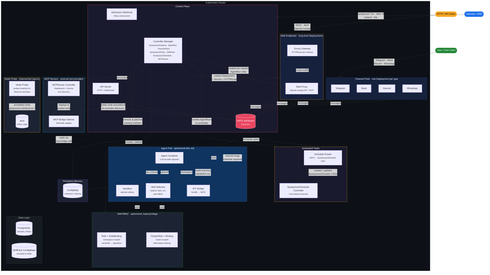

# Architecture

## System Overview



## How It Works

1. **A message arrives** via a channel pod (Telegram, Slack, etc.) and is published to the NATS event bus.
2. **The controller creates an AgentRun CR**, which reconciles into an ephemeral K8s Job — an agent container + IPC bridge sidecar + optional sandbox + skill sidecars (with auto-provisioned RBAC).
3. **The agent container** calls the configured LLM provider (OpenAI, Anthropic, Azure, Ollama, or any OpenAI-compatible endpoint), with skills mounted as files, persistent memory injected from a ConfigMap, and tool sidecars providing runtime capabilities like `kubectl`.
4. **Results flow back** through the IPC bridge → NATS → channel pod → user. The controller extracts structured results and memory updates from pod logs.
5. **Web endpoints** expose agents as HTTP APIs. When an instance has the `web-endpoint` skill, the controller creates a long-lived Deployment (serving mode) with a web-proxy sidecar. The proxy accepts OpenAI-compatible (`/v1/chat/completions`) and MCP (`/sse`, `/message`) requests, creating per-request AgentRun Jobs. An Envoy Gateway with per-instance HTTPRoutes provides external access with TLS.
6. **MCP server integration** — `MCPServer` CRDs define external tool providers using the Model Context Protocol. The controller deploys managed servers (from container images) or connects to external ones, probes them for available tools, and records discovered tools in the resource status. Agent pods access MCP tools through the `mcp-bridge` skill sidecar, which translates between the agent's tool interface and MCP's SSE/stdio transport. Tool names are prefixed to avoid collisions when multiple MCP servers are active. The web UI and CLI provide full CRUD management.
7. **Node-based inference discovery** — for local inference providers (Ollama, vLLM, llama-cpp) installed directly on host nodes, an optional node-probe DaemonSet probes localhost ports and annotates each node with discovered providers and models (`sympozium.ai/inference-*`). The API server reads these annotations, and the web wizard lets users select a node to pin their agent pods to via `nodeSelector`.
8. **Everything is a Kubernetes resource** — instances, runs, policies, skills, and schedules are all CRDs. Lifecycle is managed by controllers. Access is gated by admission webhooks. Network isolation is enforced by NetworkPolicy. The TUI and web dashboard give you full visibility into the entire system.

---

## How It Compares

| Concern | In-process frameworks | Sympozium (Kubernetes-native) |
|---------|----------------------|----------------------------|
| **Agent execution** | Shared memory, single process | Ephemeral **Pod** per invocation (K8s Job) |
| **Orchestration** | In-process registry + lane queue | **CRD-based** registry with controller reconciliation |
| **Sandbox isolation** | Long-lived Docker sidecar | Pod **SecurityContext** + PodSecurity admission |
| **IPC** | In-process EventEmitter | Filesystem sidecar + **NATS JetStream** |
| **Tool/feature gating** | In-process pipeline | **Admission webhooks** + `SympoziumPolicy` CRD |
| **Persistent memory** | Files on disk | **ConfigMap** per instance, controller-managed |
| **Scheduled tasks** | Cron jobs / external scripts | **SympoziumSchedule CRD** with cron controller |
| **State** | SQLite + flat files | **etcd** (CRDs) + PostgreSQL + object storage |
| **Multi-tenancy** | Single-instance file lock | **Namespaced CRDs**, RBAC, NetworkPolicy |
| **Scaling** | Vertical only | **Horizontal** — stateless control plane, HPA |
| **Channel connections** | In-process per channel | Dedicated **Deployment** per channel type |
| **External tools** | Plugin SDKs, in-process registries | **MCPServer CRD** — managed deployments or external endpoints, auto-discovery, prefixed tool namespacing |
| **Observability** | Application logs | `kubectl logs`, events, conditions, **OpenTelemetry traces/metrics**, **k9s-style TUI**, **web dashboard** |

---

## Key Design Decisions

| Decision | Kubernetes Primitive | Rationale |
|----------|---------------------|-----------|
| **One Pod per agent run** | Job | Blast-radius isolation, resource limits, automatic cleanup — each agent is as ephemeral as a CronJob pod |
| **Filesystem IPC** | emptyDir volume | Agent writes to `/ipc/`, bridge sidecar watches via fsnotify and publishes to NATS — language-agnostic, zero dependencies in agent container |
| **NATS JetStream** | StatefulSet | Durable pub/sub with replay — channels and control plane communicate without direct coupling |
| **NetworkPolicy isolation** | NetworkPolicy | Agent pods get deny-all egress; only the IPC bridge connects to the event bus — agents cannot reach the internet or other pods |
| **Policy-as-CRD** | Admission Webhook | `SympoziumPolicy` resources gate tools, sandboxes, and features — enforced at admission time, not at runtime |
| **Memory-as-ConfigMap** | ConfigMap | Persistent agent memory lives in etcd — no external database, no file system, fully declarative and backed up with cluster state |
| **Schedule-as-CRD** | CronJob analogy | `SympoziumSchedule` resources define recurring tasks with cron expressions — the controller creates AgentRuns, not the user |
| **Skills-as-ConfigMap** | ConfigMap volume | SkillPacks generate ConfigMaps mounted into agent pods — portable, versionable, namespace-scoped |
| **Skill sidecars with auto-RBAC** | Role / ClusterRole | SkillPacks can declare sidecar containers with RBAC rules — the controller injects the container and provisions ephemeral, least-privilege RBAC per run |
| **PersonaPacks** | Operator Bundle | Pre-configured agent bundles — the controller stamps out SympoziumInstances, Schedules, and memory ConfigMaps. Activating a pack is a single TUI action |
| **MCP servers as CRD** | Deployment + Service | `MCPServer` resources declare external tool providers — the controller manages deployment lifecycle, probes for tools, and the bridge sidecar translates MCP protocol to agent tool calls. Prefixed tool names prevent collisions across providers |
| **Node probe DaemonSet** | DaemonSet | Discovers host-installed inference providers (Ollama, vLLM) by probing localhost ports — annotates nodes so the control plane can offer model selection and node pinning without manual configuration |

---

## Project Structure

```
sympozium/
├── api/v1alpha1/           # CRD type definitions
├── cmd/                    # Binary entry points
│   ├── agent-runner/       # LLM agent runner (runs inside agent pods)
│   ├── controller/         # Controller manager (reconciles all CRDs)
│   ├── apiserver/          # HTTP + WebSocket API server (+ embedded web UI)
│   ├── ipc-bridge/         # IPC bridge sidecar (fsnotify → NATS)
│   ├── web-proxy/          # Web proxy (OpenAI-compat API + MCP gateway)
│   ├── webhook/            # Admission webhook (policy enforcement)
│   ├── node-probe/         # Node probe DaemonSet (inference provider discovery)
│   └── sympozium/          # CLI + interactive TUI
├── web/                    # Web dashboard (React + TypeScript + Vite)
├── internal/               # Internal packages
│   ├── controller/         # Kubernetes controllers (6 reconcilers)
│   ├── orchestrator/       # Agent pod builder & spawner
│   ├── apiserver/          # API server handlers
│   ├── mcpbridge/          # MCP bridge sidecar (SSE/stdio adapter)
│   ├── eventbus/           # NATS JetStream event bus
│   ├── ipc/                # IPC bridge (fsnotify + NATS)
│   ├── webhook/            # Policy enforcement webhooks
│   ├── webproxy/           # Web proxy handlers (OpenAI, MCP, rate limiting)
│   ├── session/            # Session persistence (PostgreSQL)
│   └── channel/            # Channel base types
├── channels/               # Channel pod implementations
├── images/                 # Dockerfiles for all components
├── config/                 # Kubernetes manifests
│   ├── crd/bases/          # CRD YAML definitions
│   ├── manager/            # Controller deployment
│   ├── rbac/               # ClusterRole, bindings
│   ├── webhook/            # Webhook configuration
│   ├── network/            # NetworkPolicy for agent isolation
│   ├── nats/               # NATS JetStream deployment
│   ├── cert/               # TLS certificate resources
│   ├── personas/           # Built-in PersonaPack definitions
│   ├── skills/             # Built-in SkillPack definitions
│   ├── policies/           # Default SympoziumPolicy presets
│   └── samples/            # Example CRs
├── migrations/             # PostgreSQL schema migrations
├── docs/                   # Documentation (this site)
├── Makefile
└── README.md
```
